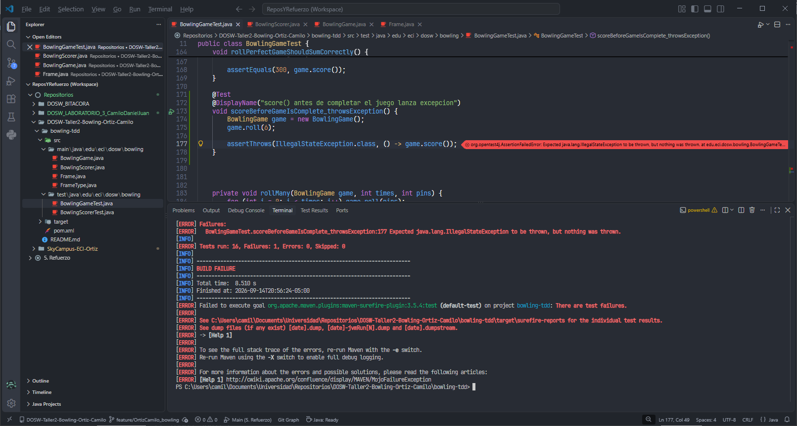
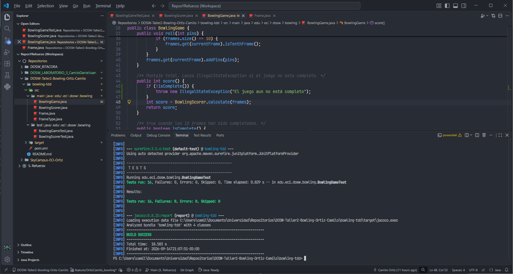
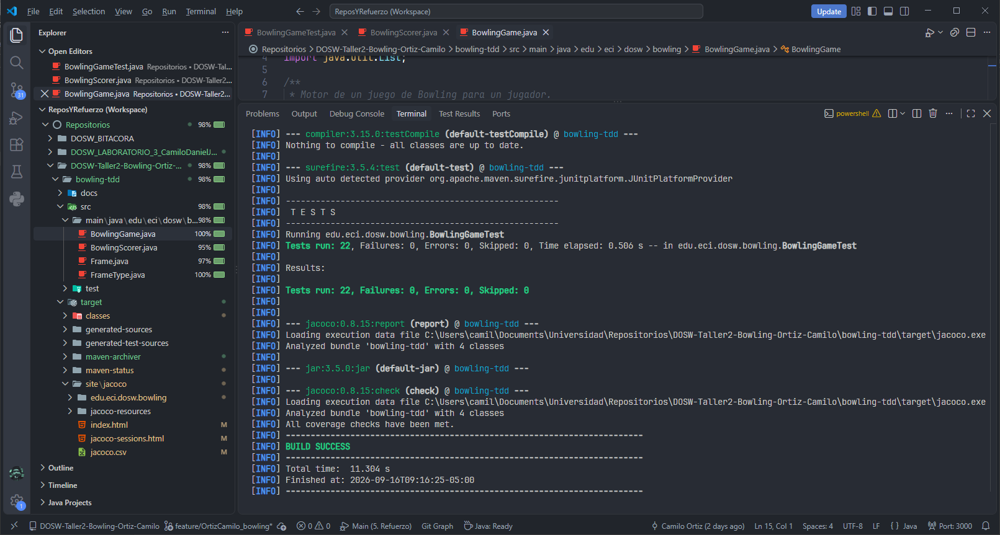
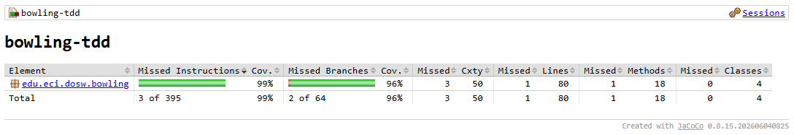
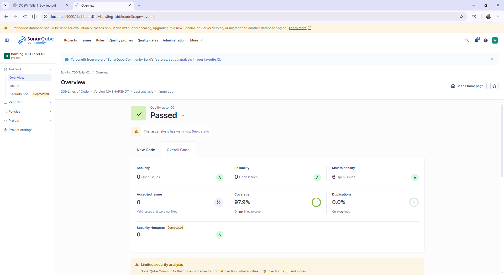
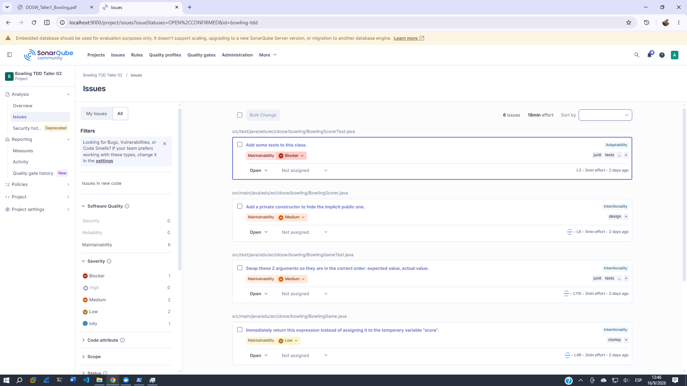
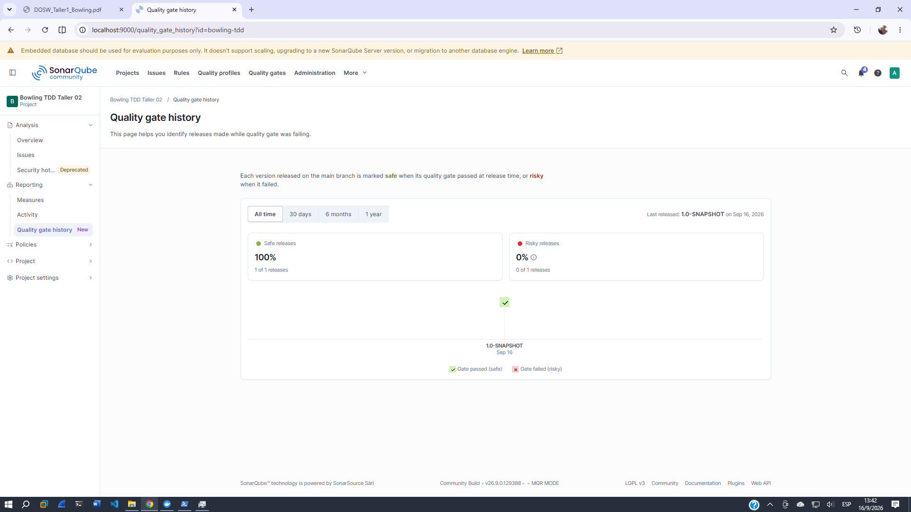

# **DOSW-Taller2-Bowling-Ortiz-Camilo**

## 1. Identificación
- **Nombre:** Cristian Camilo Ortiz Sanchez
- **Código Estudiantil:** 1000105286
- **Correo Institucional:** `cristian.ortiz-s@mail.escuelaing.edu.co`
  
## 2. Descripción

BowlTech S.A.S. es una empresa que administra pistas de bolos y que quiere digitalizar su sistema de puntuación, que actualmente se realiza de forma manual. El proyecto consiste en desarrollar un motor de puntuación de bolos capaz de registrar los tiros y calcular automáticamente el puntaje de una partida, aplicando las reglas oficiales del dominio.

#### REGLAS DEL DOMINIO
|Situación|Condición|Puntuación|
|:---|:---|:---|
|Tiro normal|Derriba algunos pinos sin completar 10|Solo los pinos derribados en ese tiro|
|Spare /|Derriba los 10 pinos en 2 intentos del mismo frame| 10 + primer tiro del siguiente frame|
|Strike X |Derriba los 10 pinos en el primer intento|10 + suma de los dos tiros siguientes|
|Frame 10|Si hay strike o spare en el frame 10|Hasta 3 tiros en el frame 10|
|Juego perfecto |12 strikes consecutivos|300 puntos (maximo posible)|

#### RESPONSABILIDADES DE CADA CLASE
- `BowlingGame:` Es el motor principal del juego
- `Frame:` Representa un frame con sus tiros
- `FrameType:` enum: NORMAL, SPARE, STRIKE, TENTH
- `BowlingScorer:` calcula el puntaje total

## 3. Evidencia TDD

A continuación se muestra la evidencia de un Ciclo de TDD, específicamente el caso de prueba `B8`. Lanzar `IllegalStateException` si se llama al método `score()` antes de completar el juego.

### RED

### GREEN

## 4. JaCoCo

La primera vez que se ejecutó el `mvn clean verify`, el coverage marcó 96% en branches y un 99% en lineas. Así que no fue necesario realizar más tests que subieran el coverage.

## 5. SonarQube

### Captura del coverage

### Captura de los issues encontrados

### Captura del estado del Quality Gate

## 6. Pull Requests

|Enlace al PR|Fecha de merge|Modulos cubiertos|
|:---|:---|:---|
|https://github.com/CatrachoINXS/DOSW-Taller2-Bowling-Ortiz-Camilo/pull/1|2026-09-16T14:26|Partes 1, 2, 3 y avance en documentación|
||||
||||

## 7. Reflexión

#### - *01 ¿Qué casó edge del Bowling fue el más difícil de implementar con TDD y por que?*
#### - *02 ¿Qué parte del código cambió durante REFACTOR sin modificar el comportamiento observable?*
#### - *03 ¿Qué casos de prueba descubriste al revisar el reporte de cobertura de JaCoCo que no habían considerado antes?*
#### - *04 ¿Qué hallazgo de SonarQube produjo un cambio real en el código?*